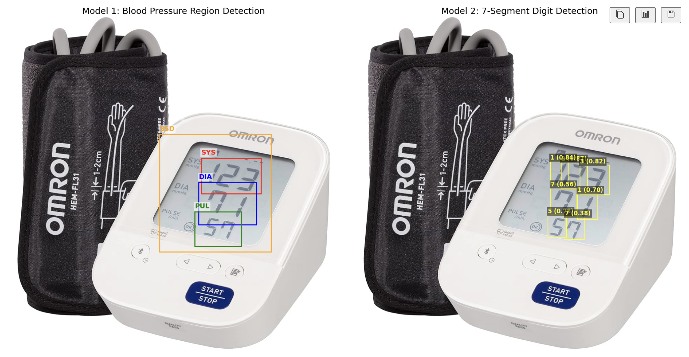

# Blood-pressure-monitor-OCR
Here we present an approach for measuring systolic pressure, diastolic pressure and pulse using a fine-tuned YOLOv8 model together with 7-segment display digit recognition.




## Install dependencies

```bash
pip install -r requirements.txt
```

## Main Contributions

### **1. Custom Dataset Collection and Annotation**  
- Collected **263 images** of blood pressure monitors from online web pages.
- Performed data cleaning and **bounding box annotation using Darwin v7**.
- Images and annotations are stored in `./blood_pressure_monitors.v2i.yolov8-obb` and split into **train / valid / test**.

### **2. ROI Detection Using YOLOv8**  
- Fine-tuned YOLOv8-obb to detect key regions of interest (ROI), including:  
  - Systolic  
  - Diastolic  
  - Pulse  
  - Indicators / auxiliary screen elements  
- The final weight is store in `./blood_pressure_monitors.v2i.yolov8-obbruns/obb/train3/weights/last.pt`

### **3. 7-Segment Digit Recognition**
Two OCR strategies are supported:
#### (a) Pytesseract
- Lightweight OCR for clean and simple displays.

#### (b) YOLO-based Digit Classifier
- The pretrained model weight is downloaded from:  
  https://github.com/MojtabaZarreh/YOLO-Based-Digit-Detection-for-LED-Displays
- The model weight is stored as `./gh_yolov8_best.pt`.


